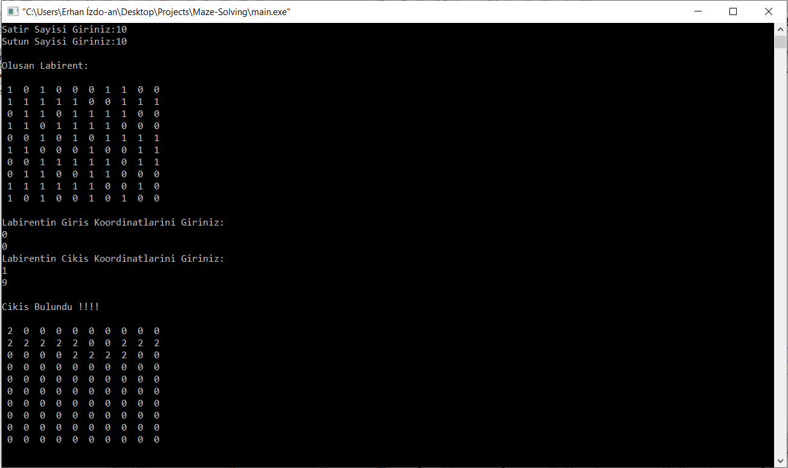

# Maze-Solving
### Pro. Lab. Project 3 : Solving Maze Problem With Stack

The Maze Solving app creates a labyrinth with a one-way linked list according to the number of rows and columns requested from the user, . then takes the entrance and exit coordinates of the labyrinth from the user.
Then  it travels through the  maze using a stack. Goes to the right by default if there is a wall in front of it changes its direction sequantially (North, East, South, West). Every point reached is added to the stack. If it reaches a dead-end point, the last point added to the stack is taken and it goes to that point and continues to change direction from there.
This process continues until the way out is found or until there are no elements in the stack. If there is no element left in the stack, it means there is no way out.

